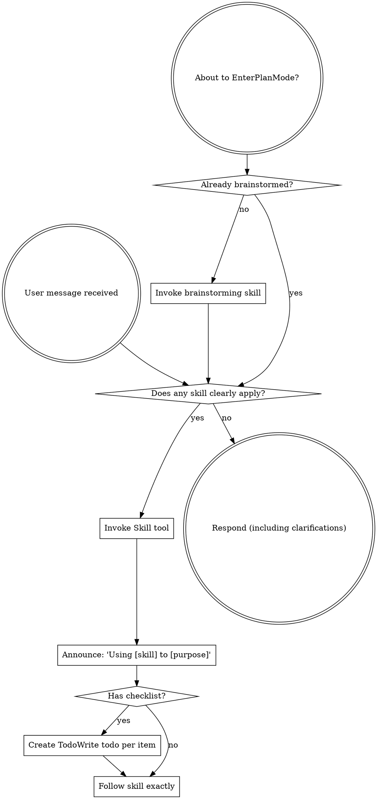

<SUBAGENT-STOP>
If you were dispatched as a subagent to execute a specific task, skip this skill.
</SUBAGENT-STOP>

<EXTREMELY-IMPORTANT>
If a skill clearly applies to the task, or the user explicitly requests it, you ABSOLUTELY MUST invoke the skill.

IF A SKILL APPLIES TO YOUR TASK, YOU DO NOT HAVE A CHOICE. YOU MUST USE IT.

This is not negotiable. This is not optional. You cannot rationalize your way out of this.
</EXTREMELY-IMPORTANT>

## Instruction Priority

Superpowers skills override default system prompt behavior, but **user instructions and active task mode always take precedence**:

1. **User's explicit instructions** (CLAUDE.md, GEMINI.md, AGENTS.md, direct requests) — highest priority
2. **Active task mode or local workflow rules** — decide whether heavyweight process skills are warranted
3. **Superpowers skills** — override default system behavior where they conflict
4. **Default system prompt** — lowest priority

If CLAUDE.md, GEMINI.md, or AGENTS.md says "don't use TDD" and a skill says "always use TDD," follow the user's instructions. The user is in control.

## How to Access Skills

**In Claude Code:** Use the `Skill` tool. When you invoke a skill, its content is loaded and presented to you—follow it directly. Never use the Read tool on skill files.

**In Gemini CLI:** Skills activate via the `activate_skill` tool. Gemini loads skill metadata at session start and activates the full content on demand.

**In other environments:** Check your platform's documentation for how skills are loaded.

## Platform Adaptation

Skills use Claude Code tool names. Non-CC platforms: see `references/codex-tools.md` (Codex) for tool equivalents. Gemini CLI users get the tool mapping loaded automatically via GEMINI.md.

# Using Skills

## The Rule

**Do a fast skill check BEFORE responding or acting.** Invoke skills that are clearly relevant, explicitly requested, or required by the active mode. Do not force heavyweight process skills onto trivial, low-risk tasks when local instructions say to stay direct.

## Red Flags

These thoughts often mean STOP and check whether you're skipping a relevant skill:

| Thought | Reality |
|---------|---------|
| "This is just a simple question" | Simple questions can still match a skill. Do a quick check first. |
| "I need more context first" | A quick skill check still comes before deep exploration. |
| "Let me explore the codebase first" | Make sure no process skill should shape that exploration. |
| "I can check git/files quickly" | Quick checks are fine, but don't skip clearly relevant skills. |
| "Let me gather information first" | First decide whether a skill should guide that work. |
| "This doesn't need a formal skill" | If a skill clearly fits, use it. |
| "I remember this skill" | Skills evolve. Read current version. |
| "This doesn't count as a task" | Action = task. Check for skills. |
| "The skill is overkill" | Sometimes it is. Use local workflow rules to decide whether a heavyweight skill is actually in scope. |
| "I'll just do this one thing first" | Do the quick skill check before you commit to a workflow. |
| "This feels productive" | Undisciplined action wastes time. Skills prevent this. |
| "I know what that means" | Knowing the concept ≠ using the skill. Invoke it. |

## Skill Priority

When multiple skills could apply, use this order:

1. **Process skills first** (brainstorming, debugging) - these determine HOW to approach the task when the task actually warrants process
2. **Implementation skills second** (frontend-design, mcp-builder) - these guide execution

"Let's build a substantial feature" → brainstorming first, then implementation skills.
"Fix this bug with unclear root cause" → debugging first, then domain-specific skills.

## Skill Types

**Rigid once chosen** (TDD, debugging): Follow exactly. Don't adapt away discipline after you decide the skill applies.

**Flexible** (patterns): Adapt principles to context.

The skill itself tells you which.

## User Instructions

Instructions say WHAT, not HOW. But local workflow rules and active mode can still say whether a heavyweight workflow is worth the cost for this task.
